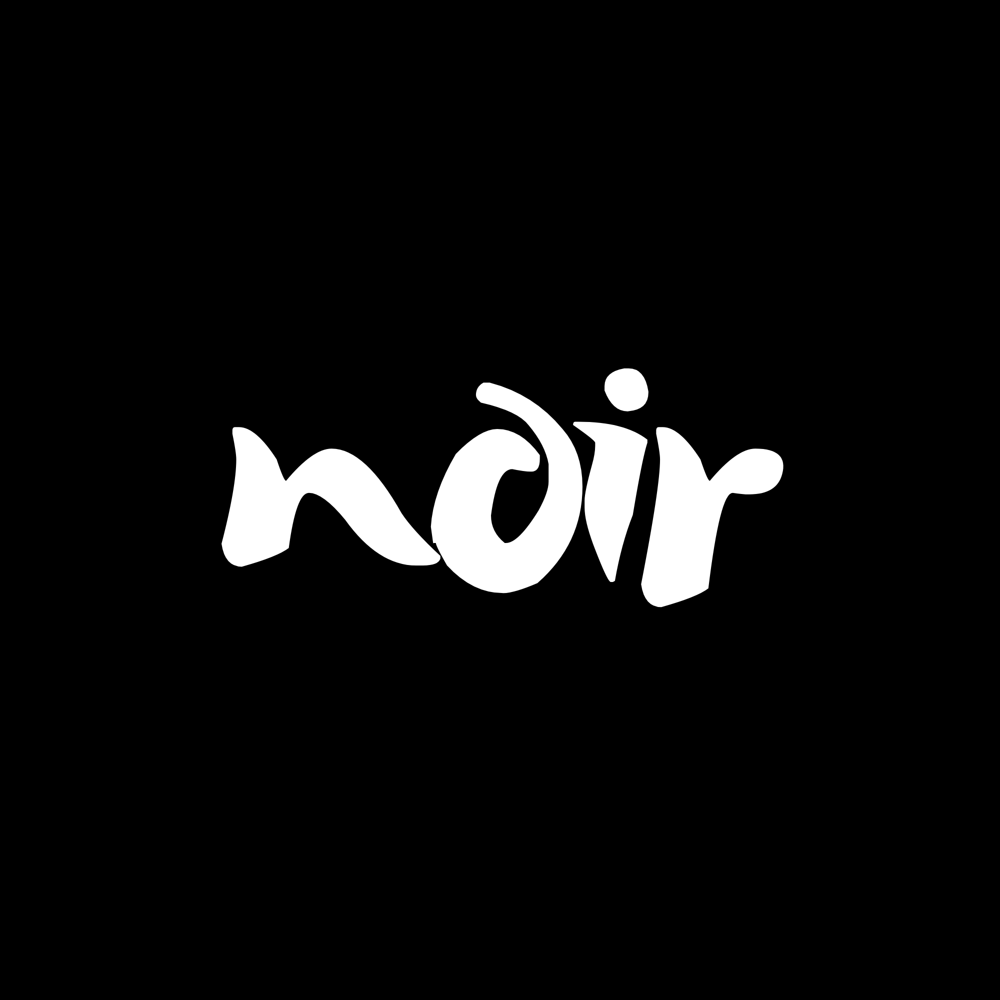

<p align="center">
  
</p>

<p align="center">
  
  
  
  
  
</p>

## NOIR

**A bilingual poem studio** for English and Vietnamese.

NOIR treats poetry like an instrument: you bring a spark, it gives you form, rhythm, and a way back in.

Write from a prompt. Choose a literary form. Tune the mood. Revise without losing the voice.

Export a clean, themed PNG for sharing.

## Features

Language and form:

- Vietnamese: free verse, lục bát, thất ngôn tứ tuyệt
- English: free verse, Shakespearean sonnet, haiku

Controls and workflow:

- mood, length, must-include, avoid
- revisions: darker, softer, shorter, more imagery, re-voice
- export: copy text or save as a themed PNG (auto two-column layout for long poems)

## Tech

- Next.js (App Router)
- `next-themes` for light/dark
- OpenRouter: `openai/gpt-oss-20b:free`

## Local development

```bash
npm install
npm run dev
```

Create `.env`:

```bash
OPENROUTER_API_KEY=...
APP_URL=http://localhost:3000
```

Open `http://localhost:3000`.

## API

- `POST /api/poem`
  - Generate or revise a poem from controls and optional revision instructions.

## Notes

- Do not commit `.env`. This repository ignores it via `.gitignore`.

